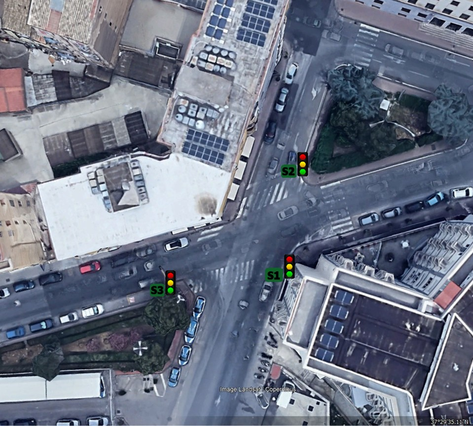
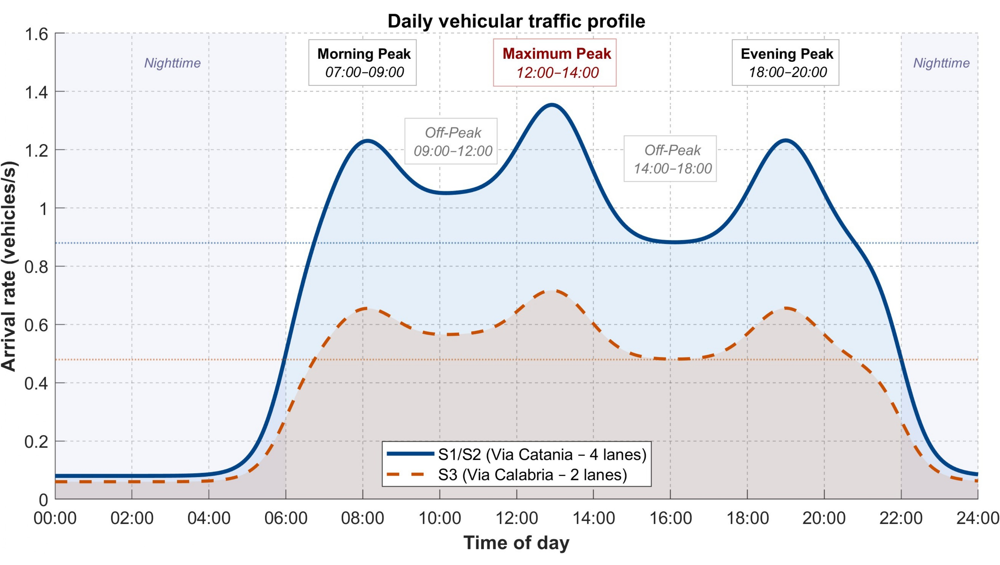
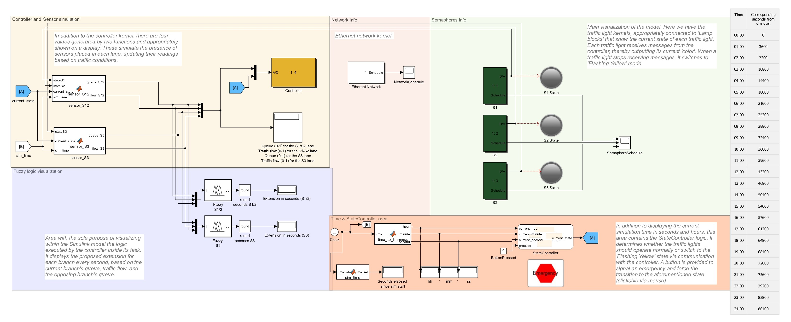
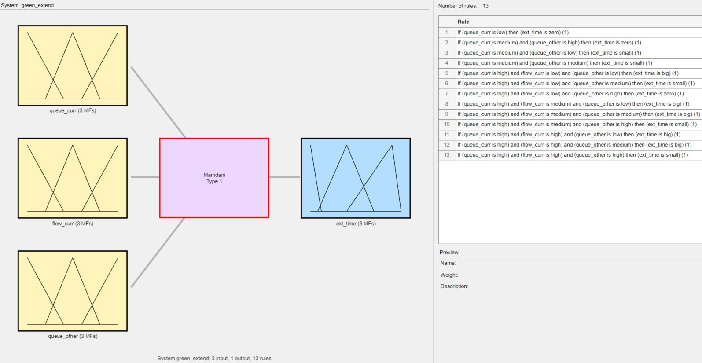
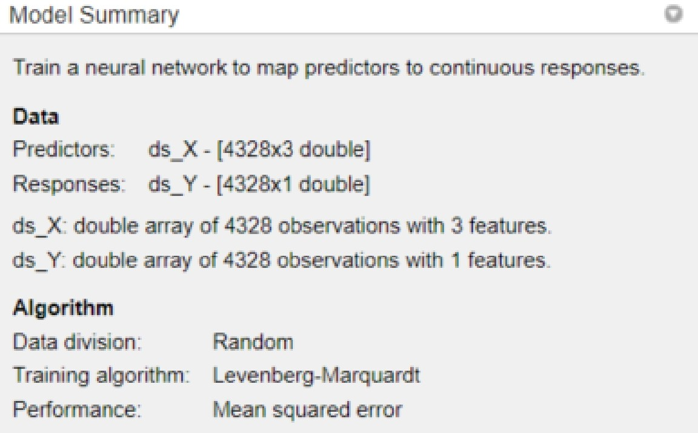
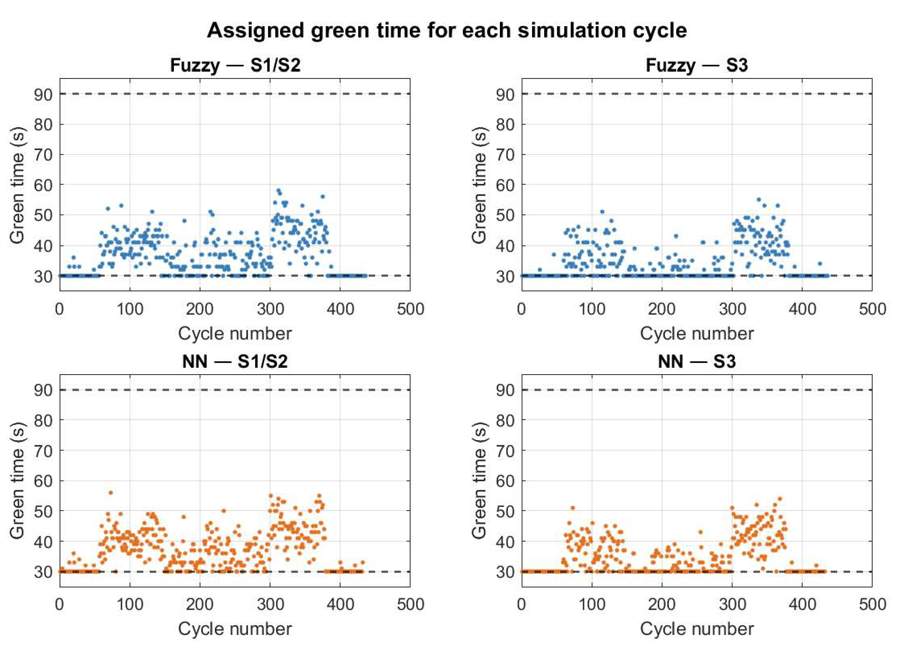
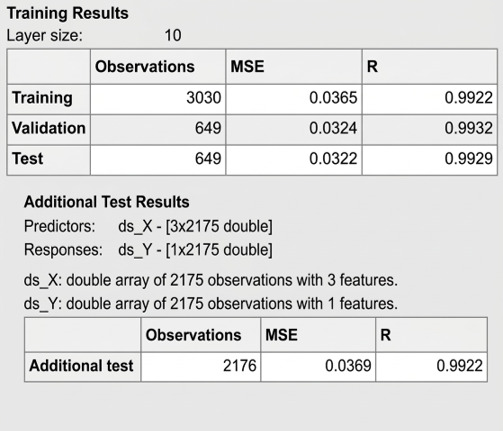
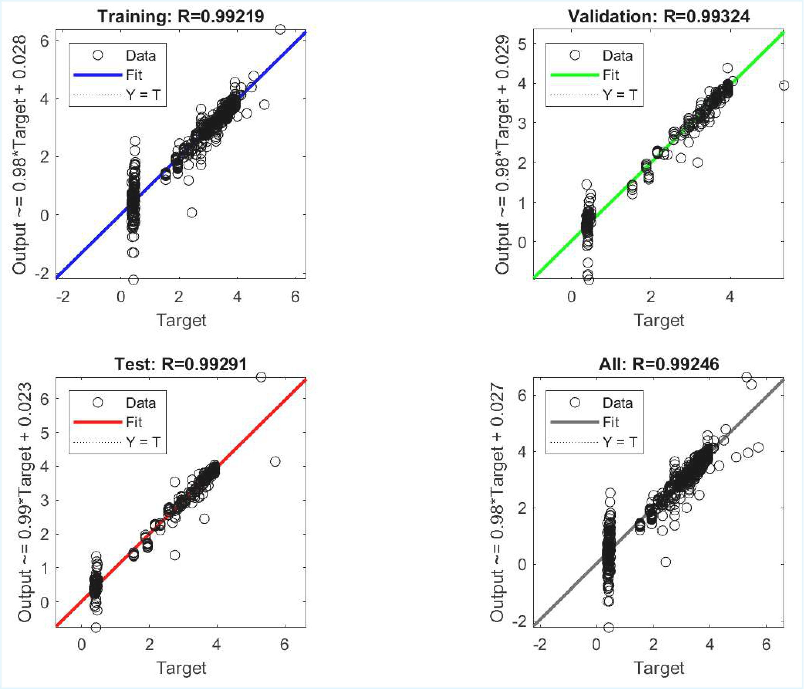

# Smart management of a signalized traffic intersection: a comparison between fuzzy logic and supervised neural networks 

**Bachelor's Thesis** – Computer Engineering  
**Institution**: Università degli Studi di Enna "Kore" | A.A. 2024/2025  
**Author**: Simone Giovanni Matraxia | **Supervisor**: Prof. Giovanni Pau  
**Grade**: 98/110  

## Abstract

Urban traffic congestion remains a persistent challenge for city administrations,
particularly when traditional fixed-time traffic lights are used due to their inherent
rigidity. This thesis investigates the design of an adaptive and intelligent traffic
light control system capable of dynamically responding to real-time traffic conditions.

The study builds upon a previously developed fuzzy-logic controller designed for an
asymmetric intersection in the city of Caltanissetta, Italy. Starting from this
expert-system approach, the work introduces an Artificial Neural Network (ANN) trained
through supervised learning to replicate and potentially enhance the decision-making
process of the fuzzy controller.

Experimental results show that the trained neural network successfully reproduces
the behavior of the fuzzy controller while eliminating the need for manual rule
calibration. This data-driven approach improves system scalability and adaptability,
offering a promising solution for intelligent traffic management within modern smart
city infrastructures.

## Case Study & Project Modeling
The system models a real-world asymmetric intersection in Caltanissetta, Italy (Via Catania / Via Calabria). 



The traffic flows are irregular and simulated via an estimated hourly profile that characterizes heavy morning, maximum, and evening peaks.



The architecture processes real-time vehicle queuing data through a Stateflow controller, managing the network kernels and simulating realistic delays or packet losses between the sensors, the controller, and the physical semaphores.



## Control Architecture: Fuzzy vs. NN
To establish a baseline, a Fuzzy Logic expert system was first implemented. Subsequently, a Neural Network was trained using the data generated by the Fuzzy system to evaluate a scalable, data-driven approach.
* **Fuzzy Logic Expert System**: A baseline Mamdani system evaluating 3 inputs (Current Queue, Traffic Flow, Opposite Queue) to compute green time extensions (0-10s) based on a manually calibrated set of 13 inference rules.
* **Supervised Neural Network**: A 3-10-1 Feed-Forward architecture designed using the Deep Learning Toolbox. Trained on 4,328 samples generated from the Fuzzy evaluations utilizing the Levenberg-Marquardt algorithm.

<table>
  <tr>
    <td width="50%" align="center"></td>
    <td width="50%" align="center"></td>
  </tr>
  <tr>
    <td align="center"><i>Fuzzy Logic Designer (Mamdani)</i></td>
    <td align="center"><i>Feed-Forward NN (3-10-1)</i></td>
  </tr>
</table>


## Core Features & Technical Pipeline
* **TrueTime 2.0 Integration**: Simulates real-time embedded network dynamics, control task scheduling, and packet loss/delays between the sensors, the controller, and the physical semaphores.
* **Fault Tolerance Logic**: Implements "fail-safe" safety routines inside the semantic nodes (e.g., Flashing Yellow state) to autonomously handle network saturations and communication blackouts.
* **Data-Driven Optimization**: Eliminates the need for manual rule calibration by learning from historical decisions rather than rigid programming, ensuring readiness for urban IoT networks.

## Key Performance Results
Both controllers were tested over 9 simulated hours. The Neural Network successfully replicated the expert system's behavior, maintaining highly competitive average vehicle wait times without the need for manual rule hardcoding.



* **Accuracy**: The Neural Network achieved an R correlation coefficient of `0.9929` on the test set, with a Mean Squared Error (MSE) of `0.0322`.
<table>
  <tr>
    <td width="50%" align="center"></td>
    <td width="50%" align="center"></td>
  </tr>
  <tr>
    <td align="center"><i>Training State and Validation Performance</i></td>
    <td align="center"><i>Regression Plot (R = 0.9929)</i></td>
  </tr>
</table>

* **Average Wait Times**: Demonstrated equivalent functional performance (Δ < 1%) across intersection branches:
  * *Primary Branch (S1/S2)*: 35.8s (Fuzzy) vs. 36.3s (NN).
  * *Secondary Branch (S3)*: 38.5s (Fuzzy) vs. 38.7s (NN).


## File Structure
* `/src`: MATLAB/Simulink source files (`.m` scripts, `.slx` models, `.mat` data).
* `/results`: Generated performance plots, regression matrices, and metrics.
* `/thesis`: Full academic documentation (PDF thesis and presentation slides).
* `/assets`: Visual assets and diagrams used for this documentation.
* `/data`: Datasets for Neural Network training and validation.

## Technical Stack
* **Language/Environment**: MATLAB, Simulink
* **Toolboxes**: Fuzzy Logic Toolbox, Deep Learning Toolbox (Neural Network Fitting), Stateflow
* **Libraries**: TrueTime 2.0 (Real-time control system simulation)

## How to Build and Run
*Note: Ensure you have MATLAB installed with the required Toolboxes and TrueTime 2.0 configured in your path.*

1. Clone the repository to your local machine:
```bash
git clone [https://github.com/simonematraxia/smart-traffic-fuzzy-vs-nn.git](https://github.com/simonematraxia/smart-traffic-fuzzy-vs-nn.git)
cd smart-traffic-fuzzy-vs-nn
```
2. Add the /src folder to your MATLAB path.

3. Open the controller_init.m or equivalent initialization scripts to load the workspace variables.

4. Launch the .slx model in Simulink and execute the simulation to view the real-time scopes and Stateflow logic.
